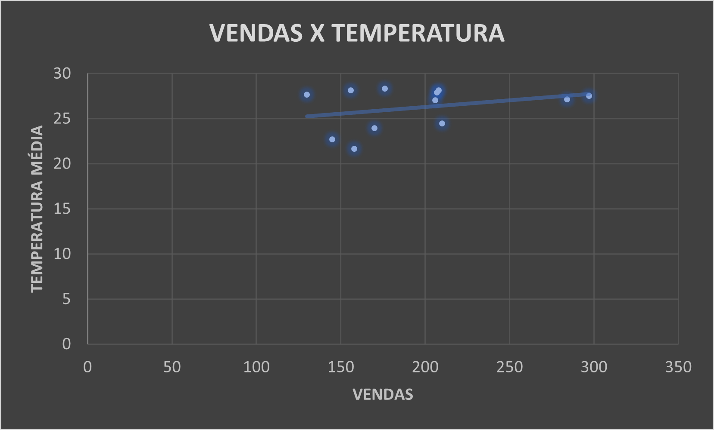
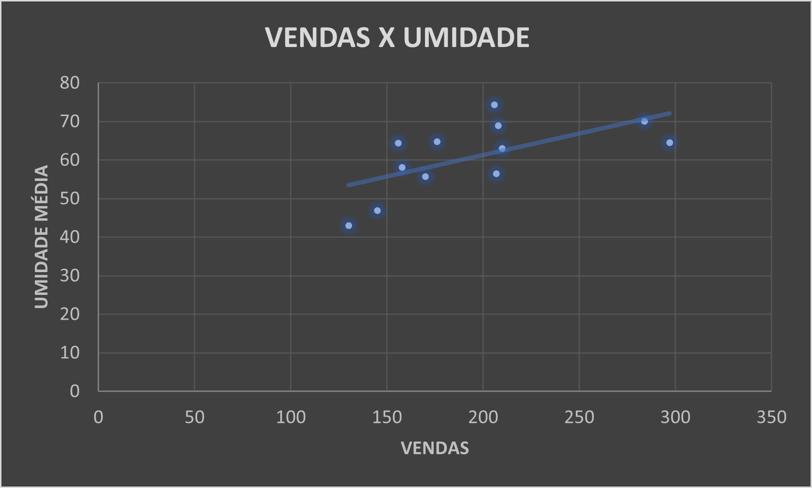
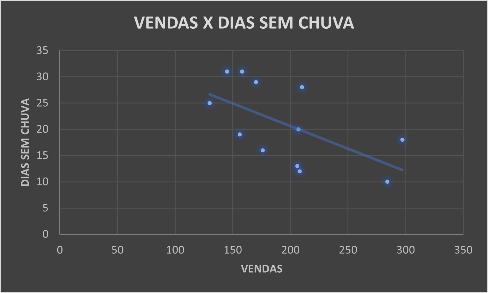

# Seasonal Tick Sales Analysis

This study analyzes the impact of climatic variables—such as average temperature, average humidity, and dry days—on the sales of oral ectoparasitic medications in Três Lagoas during 2024. The aim is to identify seasonal patterns and correlations, ultimately optimizing inventory and marketing strategies for the company.

## Main Research Question
### How does climate influence tick-repellent sales?

## Hypotheses
- 📌 **Sales increase** in spring and summer due to warmer, more humid weather conditions.
- 📌 **Sales decrease** in autumn and winter when ticks are less active due to cooler, drier conditions.
- 📌 **Regions with stable temperatures** throughout the year exhibit little variation in sales.
- 📌 **Promotions and educational campaigns** can help boost sales during low-demand periods.

## Methodology
Data for this study were sourced from the following:
- **Climate data** (temperature, humidity, and dry days) from [CEMTEC-MS](https://www.cemtec.ms.gov.br/bancodedados/2024-2/).
- **Sales data** from **Report 338 - Sales Movement by Product**.

The analysis was conducted using **Microsoft Excel**, applying correlation calculations and scatter plots to identify patterns and trends.

## Results and Analysis

### 1. Correlation Between Sales and Average Temperature
- **Correlation coefficient**: 0.32 (weak positive correlation).
- **Findings**: There is a slight positive relationship between temperature and sales, indicating a small increase in demand during warmer months. However, temperature alone is not a decisive factor in sales volume.

### 2. Correlation Between Sales and Average Humidity
- **Correlation coefficient**: 0.63 (moderate to strong correlation).
- **Findings**: Higher humidity levels correlate with increased tick-repellent sales. This makes sense, as ticks thrive in warm, humid conditions, driving demand for control products.

### 3. Correlation Between Sales and Dry Days
- **Correlation coefficient**: -0.59 (moderate negative correlation).
- **Findings**: Longer dry periods lead to lower sales, suggesting that more frequent rainfall boosts tick proliferation, thereby increasing the need for repellents.

## Recommendations for Optimization
Based on these findings, the company can take the following actions to improve sales and inventory management:

✅ **Inventory Planning**:  
- Plan inventory ahead of high-demand periods, particularly in the spring and summer when humidity levels are higher.

✅ **Seasonal Marketing Campaigns**:  
- Create targeted marketing campaigns in autumn and winter to maintain sales during low-demand periods. Educational content can also increase awareness of tick-related risks.

✅ **Supplier Negotiations**:  
- Work with suppliers to secure better prices or bulk discounts during peak seasons when demand is higher.

## Conclusion
The results indicate that humidity and rainy periods have a significant impact on tick-repellent sales. Temperature, however, is not a decisive factor on its own. By optimizing inventory, marketing, and pricing strategies based on climate data, the company can improve efficiency and maximize profits throughout the year.

---

### Additional Notes:

